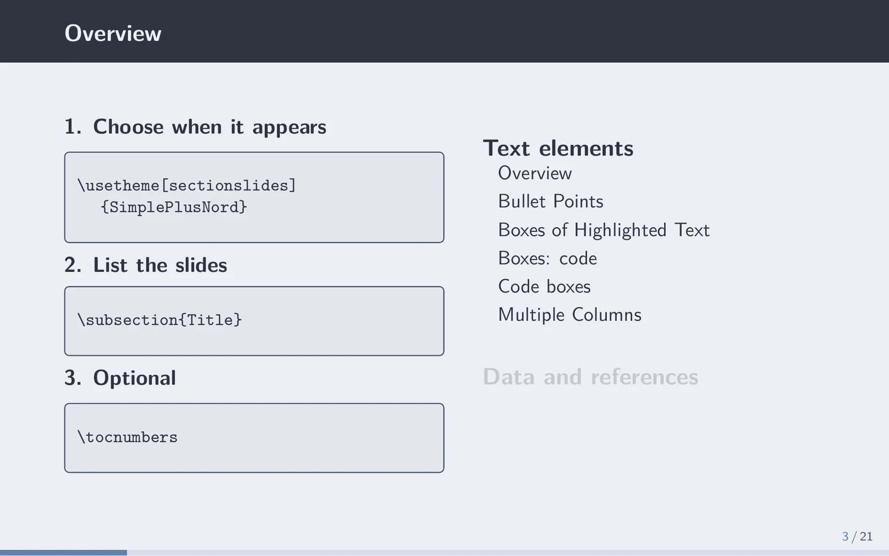
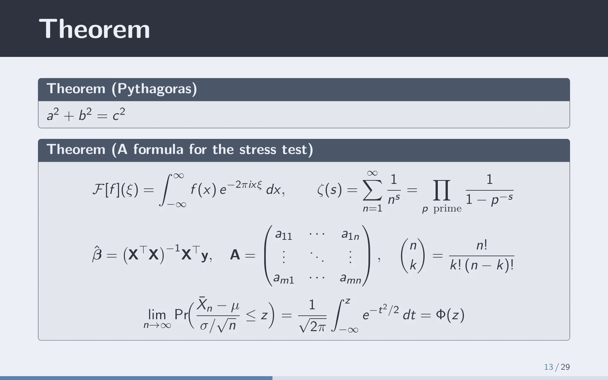
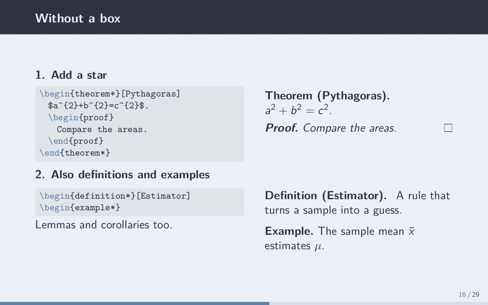
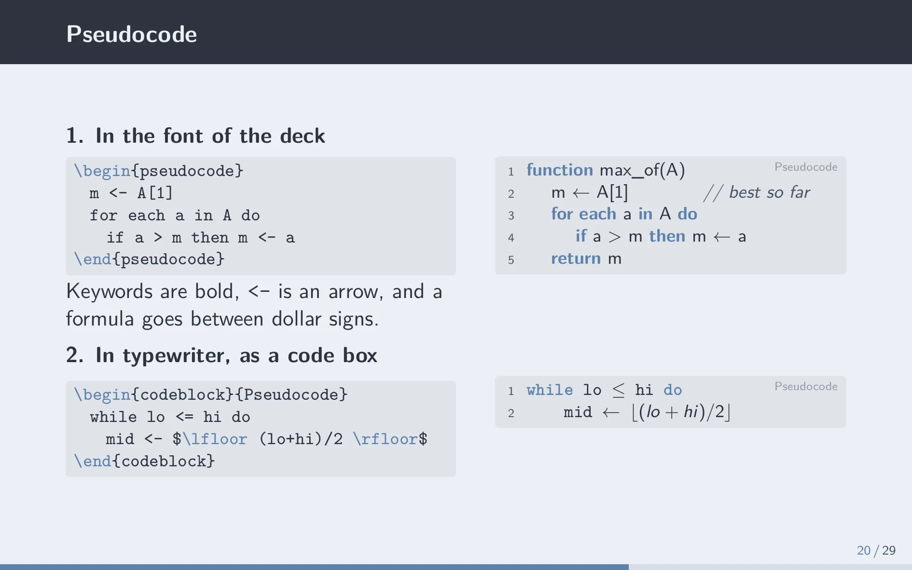
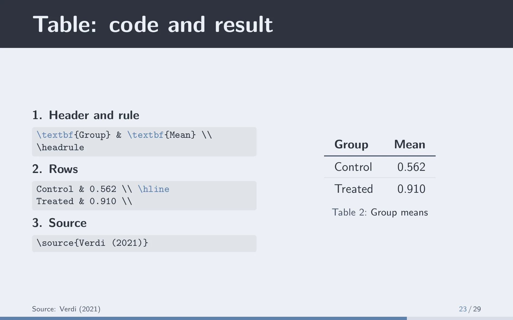
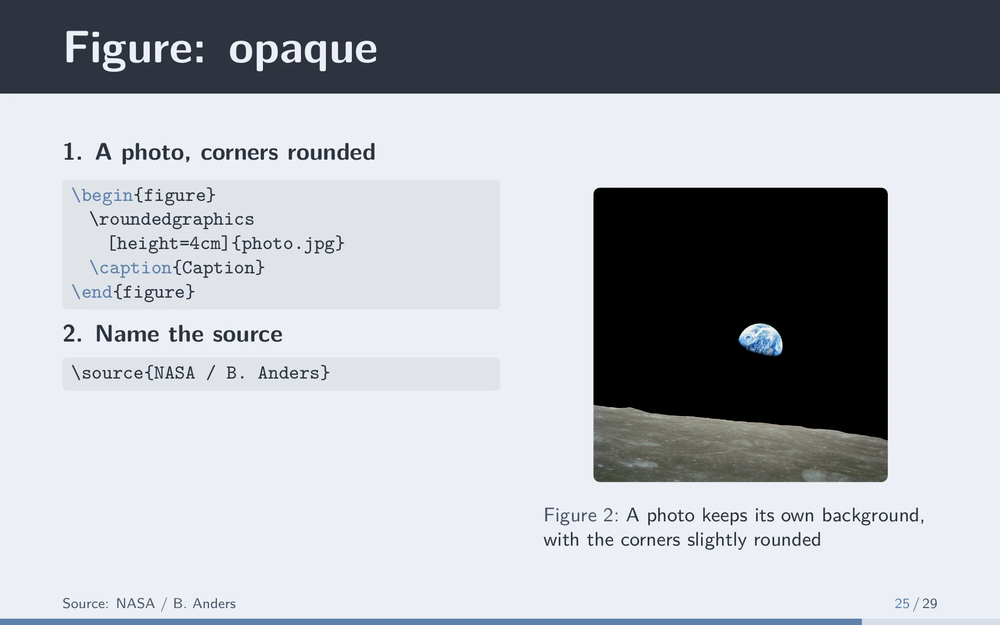

# SimplePlusNord-BeamerTheme

A light Beamer theme in the [Nord](https://www.nordtheme.com) colours, made for research talks.

| | |
|---|---|
|  |  |
|  |  |
|  |  |
|  |  |

Slides are light, with the title in a dark band. The title slide and the outline slides are dark. Every colour is one of the 16 Nord colours.

## What is here

```
beamer.tex          the deck, start here (beamer.pdf is its compiled version)
meta/               info.tex (title, author, date) and reference.bib
slides/             one file per section, then the references and the thank-you slide
slides/img/         the pictures, and their credits
theme/              the theme: you never edit it
preview/            the images above
```

`beamer.tex` loads the theme, reads `meta/info.tex` and has one `\input` per file of `slides/`. The pictures are on the graphics path, so a slide just writes `\includegraphics{graph.png}`. In `theme/` the four files are the usual Beamer ones: colours (with the Nord palette), fonts, inner theme (boxes, outline, code) and the main file with the options.

To learn the theme, read `beamer.pdf` next to `slides/`: each slide shows one thing and the code behind it.

## Start a deck

Copy the folder, replace the files in `slides/` with your own sections (keep the `\input` lines of `beamer.tex` in step), fill in `meta/`, and compile from this folder, since every path is relative to it:

```
lualatex beamer.tex
bibtex beamer
lualatex beamer.tex
lualatex beamer.tex
```

## Use the theme in a deck you already have

Copy `theme/` next to your `.tex` file and point LaTeX at it on the first line:

```latex
\makeatletter\def\input@path{{theme/}}\makeatother
\documentclass[aspectratio=1610]{beamer}
\usetheme{SimplePlusNord}

\title{Title}
\author{Name Surname}

\begin{document}
\begin{frame}
    \titlepage
\end{frame}

\begin{frame}{A slide}
    Some text.
\end{frame}
\end{document}
```

It is drawn for 16:10, so keep `aspectratio=1610`. Write `\end{frame}` alone on its line (see "Fragile frames" below). It works with pdfLaTeX, XeLaTeX and LuaLaTeX, tried on TeX Live 2023, and needs `tcolorbox`, `listings`, `colortbl` and `booktabs`, which TeX Live has. It uses `\AddToHook`, so very old LaTeX releases will not do.

## Outline slides

Two options add an outline of the sections, one column each, on a dark slide:

- `\usetheme[overview]{SimplePlusNord}`: one right after the title slide.
- `\usetheme[sectionslides]{SimplePlusNord}`: one before every section, with the section that starts lit and the others faded.

A slide shows up in the outline only if a `\subsection{Title}` comes before it, because Beamer cannot read frame titles. To keep a slide out, write `\subsection*{Title}` or no `\subsection` at all (it then belongs to the entry before). `\section*` does the same for a whole section.

For the references, write `\extrasection{References}` instead of `\section`. It goes last in the outline, in blue, as a line under the columns, and no section slide opens it. The theme learns about it on the second run, so compile twice.

## What you can write

- **Boxes:** `infobox`, `alertbox` and `examplebox`, each taking a title: `\begin{infobox}{Title} ... \end{infobox}`. Theorems, definitions and lemmas are boxes too, and a `proof` goes inside the box of its theorem. With a star (`theorem*`, `definition*`, and so on) the box is gone and the text is set as in an article.
- **Tables:** `\headrule` draws the line under the header, `\hline` the thin ones between rows.
- **Sources:** `\source{Author (2021)}` prints the source at the bottom left; several calls on a slide join into one line.
- **Fading:** `\fade{text}` lightens everything inside, your own colours included.
- **Pictures:** a PNG with a transparent background goes in with `\includegraphics`; an opaque photo with rounded corners with `\roundedgraphics{file}`.
- **Dark slides:** `\darkslide`, right after `\begin{frame}`, makes a slide dark and hides its title, since the body already says it.
- **Outline by hand:** `\sectionlist` is the sections as a bulleted list, good on a dark slide after the title. `\sectioncolumns` and `\sectioncolumns[current]` give the columns, plain or with the running section lit. `\tocnumbers` numbers the entries.
- **Code:** `codeonly` shows LaTeX code, `codeblock{Python}` any other language of `listings` (also C, C++, Julia, Pseudocode), numbered and with the language name faint at the top right. `\code{mean(xs)}` sets code inside a sentence, in the typewriter font scaled to the size of the text; `\code[Python]{return sum(xs)}` colours it too.
- **Pseudocode:** `pseudocode` uses the font of the deck, with bold keywords, `<-` as an arrow and `$...$` for formulas. `codeblock{Pseudocode}` is the typewriter version.
- **Fragile frames:** every frame is read as fragile, so a code box works anywhere and you never write `[fragile]`. The price is that `\end{frame}` must stand alone on its line, and a bit more compile time. The option `nofragile` turns it off. Code inside the argument of `\only` or `\uncover` cannot work, as with any verbatim text: use `\begin{onlyenv}<2> ... \end{onlyenv}`.

## Contrast

Body text is dark on light (10.8:1). Two things are weaker, about 3.5:1: the titles of the alert and example boxes, and the current page number. No other Nord colour carries light text any better. If you present in a bright room, try it there first.

Not checked yet: the look on a projector. `\pause`, `\only`, frame options such as `[t]` or `[noframenumbering]`, and `\appendix` were tried in a small deck and work. The slides of the appendix count in the total of the page counter.

## Credits

- It started from [SimplePlus](https://github.com/pm25/SimplePlus-BeamerTheme) by Pin-Yen Huang. Most of the code has been rewritten since; thanks for the starting point. The name is different on purpose, so that TeX never loads the original by mistake.
- The palette is [Nord](https://www.nordtheme.com), under the MIT licence.
- The two pictures are credited in [slides/img/CREDITS.md](slides/img/CREDITS.md).

Released under the Unlicense, see [LICENSE](LICENSE).
