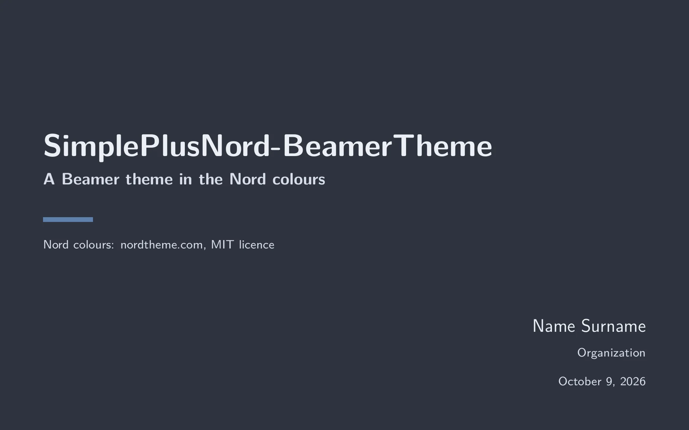
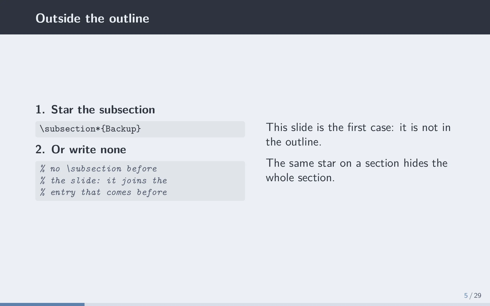
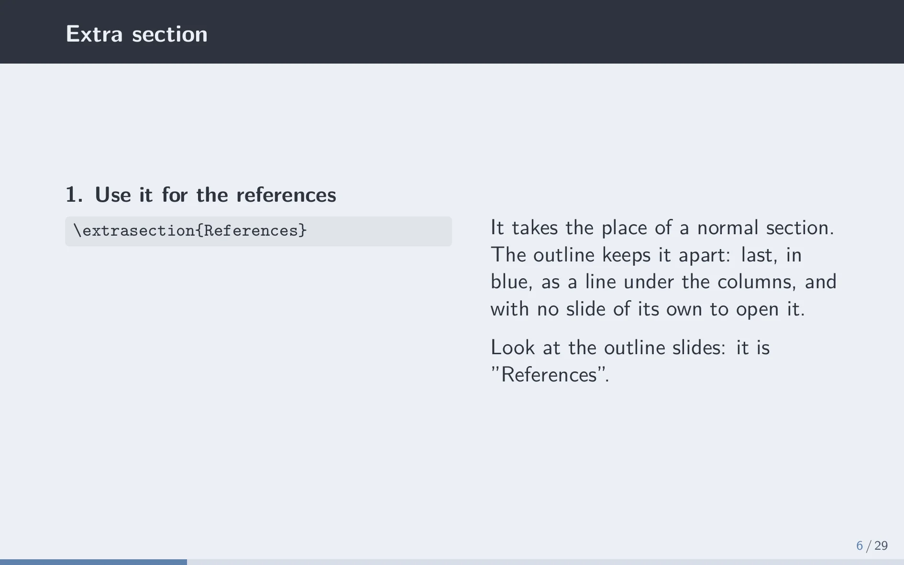
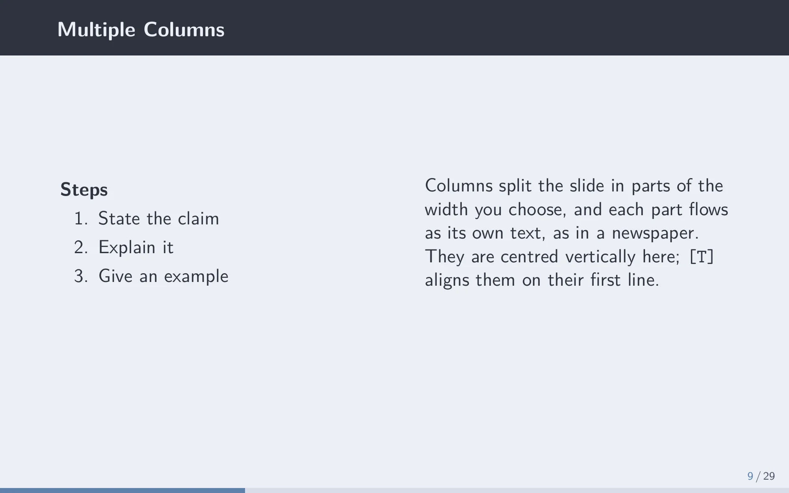
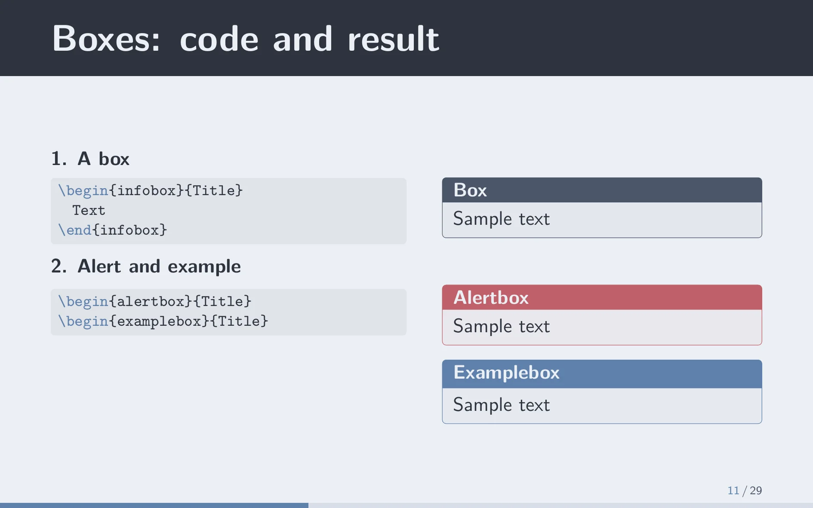
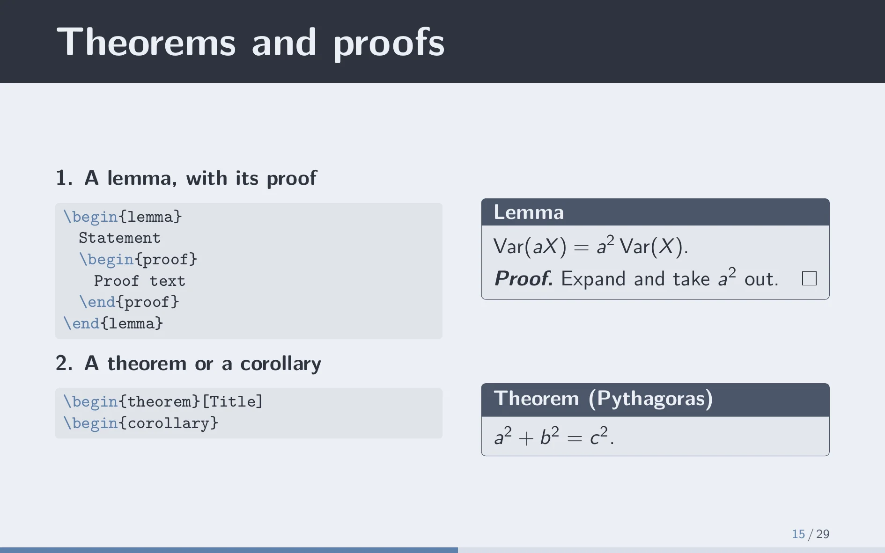

# SimplePlusNord-BeamerTheme

A light Beamer theme in the [Nord](https://www.nordtheme.com) colours, made for research talks.

| | |
|---|---|
|  |  |
|  |  |
|  |  |

The slides are light, and the title of each one sits in a dark band. The first slide is dark. Every colour comes from the 16 Nord colours.

The quickest way to learn the theme is to open `sample.pdf` next to `sample.tex`. Each slide of the sample shows one element together with the code that makes it.

## Use it

Copy the four `beamer*themeSimplePlusNord.sty` files next to your `.tex` file, and load the theme:

```latex
\documentclass[aspectratio=1610]{beamer}
\usetheme{SimplePlusNord}

\title{Title}
\author{Name Surname}
\institute{Organization}
\date{\today}

\begin{document}
\begin{frame}\titlepage\end{frame}

\begin{frame}{A slide}
    Some text.
\end{frame}
\end{document}
```

The theme is drawn for 16:10, so keep `aspectratio=1610`. It works with pdfLaTeX, XeLaTeX and LuaLaTeX (tried on TeX Live 2023) and needs `tcolorbox`, `listings`, `colortbl` and `booktabs`, which TeX Live already has. It uses `\AddToHook`, so very old LaTeX releases will not work.

The name differs from SimplePlus on purpose: TeX never loads that copy by mistake.

## Overview slides

Two options give you an overview of the sections, one column for each:

- `\usetheme[overview]{SimplePlusNord}` puts one right after the title slide.
- `\usetheme[sectionslides]{SimplePlusNord}` puts one before every section. The section that starts keeps its colour and the others fade.

An overview lists a slide only if you write `\subsection{Title}` before its frame. Beamer cannot read the frame titles by itself.

## What you can write

- **Boxes:** `\begin{infobox}{Title} ... \end{infobox}`, and `alertbox` and `examplebox` for the other two colours. Theorems, definitions and lemmas are boxes too. A `proof` has no box: put it inside the box of its theorem.
- **Tables:** `\headrule` draws the line under the header row, and `\hline` the thin lines between rows.
- **Sources:** `\source{Author (2021)}` writes the source at the bottom left. Several calls on one slide join into one line.
- **Fading:** `\fade{text}` lightens everything inside it, including colours you set yourself.
- **Pictures:** a PNG with a transparent background goes in with `\includegraphics`. For an opaque photo with rounded corners use `\roundedgraphics{file}`.
- **Dark slides:** `\darkslide`, right after `\begin{frame}`, makes any slide dark like the first one.
- **Overviews by hand:** `\sectioncolumns`, and `\sectioncolumns[current]` for the faded version. `\tocnumbers` numbers the entries.
- **Code:** `codeonly` shows code, `codeexample` shows code on the left and its result on the right. The frame has to be `[fragile]`.

## About contrast

Body text is dark on light and easy to read (10.8:1). Two things are weaker, at about 3.5:1: the titles of the alert and example boxes, and the colour of the current page number. No other Nord colour is dark enough to carry light text better. If your talk is projected in a bright room, try it there first.

Not checked yet: how the slides look on a projector, and `\pause`, `\appendix` and hidden frames. The progress strip may count them in a way you do not expect.

## Credits

- It started from [SimplePlus](https://github.com/pm25/SimplePlus-BeamerTheme) by Pin-Yen Huang. Most of the code has been rewritten since, and thanks go to him for the starting point.
- The palette is [Nord](https://www.nordtheme.com), under the MIT licence.
- The two pictures of the sample are credited in [images/CREDITS.md](images/CREDITS.md).

Released under the Unlicense, see [LICENSE](LICENSE).
